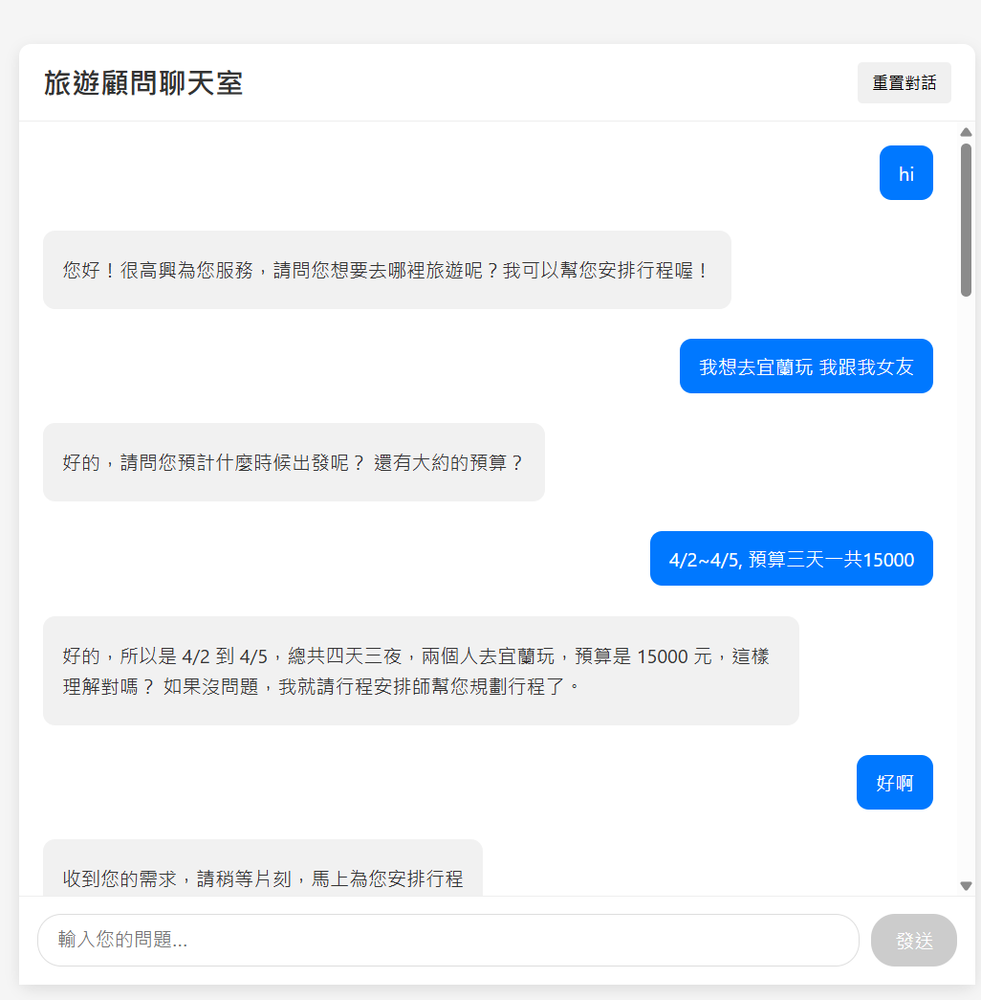

# JTCG (Japanese Travel Chat Guide)

一個基於 AI 的日本旅遊諮詢聊天機器人系統。

## 專案架構

```
.
├── backend/
│   └── app/
│       ├── agents/         # AI 代理邏輯
│       ├── main.py        # FastAPI 後端服務
│       ├── schemas.py     # 資料模型定義
│       └── Dockerfile     # 後端容器設定
├── frontend/
│   ├── src/              # React 前端程式碼
│   ├── package.json      # 前端依賴配置
│   └── Dockerfile        # 前端容器設定
└── docker-compose.yml    # 容器編排配置
```

## 技術棧

- 後端：Python + FastAPI
- 前端：React + TypeScript
- 容器化：Docker + Docker Compose

## 開始使用

### 前置需求

- Docker
- Docker Compose

### 安裝與執行

1. 複製專案
```bash
git clone [repository-url]
cd JTCG
```

2. 啟動服務
```bash
docker-compose up --build
```

3. 訪問服務
- 前端界面：http://localhost:3000
- API 文檔：http://localhost:9527/docs

## API 端點

- `GET /messages/reset` - 重置對話
- `POST /messages` - 發送新訊息
- `GET /messages/get_messages` - 獲取對話歷史
- `GET /events` - Server-Sent Events (SSE) 端點，用於即時訊息推送


## 介面截圖


## TBD

### short term
1. tool的東西太多
    - 有些要先轉json整理完再變成str
    - 有些要省去一些args

2. 3個node的prompt
    - coordinator: 讀取notebook對searcher發問
    - searcher: 用searcher_messages 對tools 做搜尋，得到答案並統整給coordinator
    - tools: 用來做搜尋的工具(不用prompt)
    - checker: 用來檢查coordinator的答案是否正確

3. 語言要注意，可能要想辦法阻止俄文、韓文
4. SSE的連線好像怪怪的，有時候開始搜尋的時候前端很久才收到server event

### long term
1. 把第一層response也串上langgraph, 這樣如果使用者不滿意或想要微調，設計比較方便。
    - SSE是否可以摸得進去?? 

2. message 用db存比較穩
    - crud 的設計，盡量不要跟schemas差太多
    - curd - schemas - langchain messages 三者轉換

